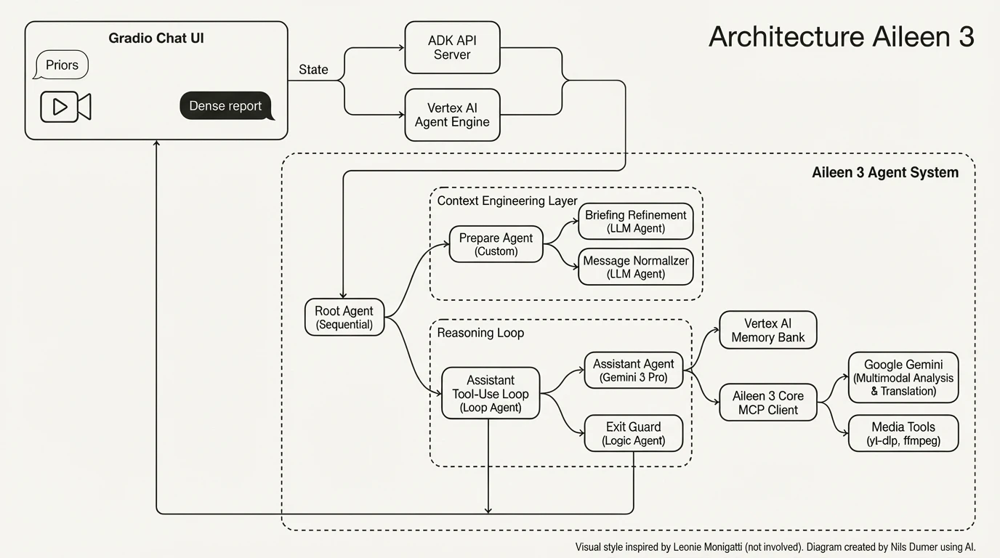

# Aileen 3 Agent: Expectation-Driven Information Foraging

<div align="center" style="display: flex; justify-content: center; gap: 10px; margin-bottom: 1em">

<a href="https://ndurner.de/links/aileen3-kaggle-video">
  
</a>
<a href="https://ndurner.de/links/aileen3-linkedin">
  
</a>
<a href="https://ndurner.de/links/aileen3-kaggle-writeup">
  
</a>
</div>

<br>

> **"Information is surprises. You learn something when things don’t turn out the way you expected."** ⸺ Roger Schank

## 📖 Overview

**Aileen 3** is an agentic AI system designed for **Information Foraging**. Unlike standard summarizers that compress content flatly, Aileen uses **Expectation-Driven Analysis**. You provide a set of "priors" (what you already know, what you expect to hear), and the agent watches and listens to long-form media (YouTube, Podcasts) to report **only the surprises** — the signal amidst the noise. This can turn a recording of a 45-minutes panel discussion into a 2-minutes read.

This repository contains the **Agentic Orchestration Layer** (`aileen3_agent`) built with the Google Agent Development Kit (ADK). It consumes tools provided by the [Aileen 3 Core MCP Server](https://ndurner.de/links/aileen3-hf-readme).

---

## 🏗️ Architecture

Aileen 3 represents a sophisticated multi-agent architecture using **Sequential**, **Loop**, and **LLM** agents, integrated with **Vertex AI Memory** and **MCP Tools**.



### Key Features

This project implements the following agent concepts:

1.  **Multi-Agent System:**
    *   **Sequential orchestration:** `ConditionalPrepAgent` prepares state before the main loop begins.
    *   **Loop Agent:** The `assistant_loop` allows the agent to reason, call tools, check status and integrate results iteratively (up to 8 turns).
    *   **Specialized Sub-Agents:** Dedicated agents for user's briefing refinement (`briefing_refinement_agent`) and message normalization (`message_fix_agent`).

2.  **Tools & MCP:**
    *   **Model Context Protocol (MCP) client:** Connects to `aileen3_core` via stdio to access long-running media tools (`start_media_retrieval`, `start_media_analysis`, `translate_slide`).
    *   **Custom Tools:** Implements `get_factual_memory_tool` to fetch context from Vertex AI.

3.  **Sessions & Memory:**
    *   **Long-Term Memory:** Integrates **Vertex AI Memory Bank** to retrieve high-confidence facts about the user's domain, acting as automatic "priors."
        * to import priors into the memory bank, a command line utility is provided (`tools/memory_bank_cli.py`)
    *   **State Management:** Persists briefing states (`briefing_refined`) across chat turns using ADK session state.

4.  **Context Engineering:**
    *   Uses a `ConditionalPrepAgent` to normalize user input (fixing grammar/spelling) and restructure complex briefing requirements into clean XML blocks before the main assistant ever sees them.

5.  **Observability:**
    *   Custom `LoggingPlugin` traces agent lifecycle events and LLM calls for debugging.

---

## 🚀 Getting Started

### Prerequisites
*   Python 3.11+
*   Docker (optional, for deployment)
*   Google Cloud Project with Vertex AI enabled
*   Gemini API Key
*   [Aileen 3 Core MCP](https://huggingface.co/spaces/MCP-1st-Birthday/aileen3-core/tree/main)

### 1. Environment Setup
Copy the example environment and fill in your credentials:

```bash
# Create .env file
GEMINI_API_KEY=AIza...
VERTEX_PROJECT_ID=your-project-id
VERTEX_LOCATION=us-central1
# Alternatively to VERTEX_PROJECT_ID and ..._LOCATION:
# VERTEX_API_KEY=...
```

### 2. Memory Bank Provisioning
Aileen uses Vertex AI Reasoning Engines for factual memory. Use the included CLI to set this up:

```bash
# Create the bank
python tools/memory_bank_cli.py create-bank --display-name "Aileen Memory"
```

``` bash
# Add the resource name reported by `create-bank` to .env
echo "AGENT_ENGINE_NAME=projects/.../locations/.../reasoningEngines/..." >> .env
```

``` bash
# Seed it with initial facts (optional)
python tools/memory_bank_cli.py add-facts --user-id neal --fact "The user's name is Neal"
```
... or use `generate` for automatic extraction of facts from bodies of text.

### 3. Running Locally
You can run the API server and UI separately, or use the Docker container.

**Using Python:**
```bash
# Install dependencies
pip install -r requirements.txt

# Start the Agent Server (Backend)
python -m agent_system.run_api_server --log_level debug

# Start the Web UI (Frontend) - in a new terminal
python -m chat_ui.main
```

**Using Docker:**
```bash
docker build -t aileen3-agent .
docker run --env-file .env -p 7860:7860 -p 8000:8000 aileen3-agent
```
Access the UI at `http://localhost:7860`.

---

## 🧩 How it Works

1.  **Briefing:** The user provides a URL and "priors" (Context, Expectations, Prior Knowledge, Questions) in the UI.
2.  **Refinement:** The `briefing_refinement_agent` cleans this input, splitting expectations into bullet points for better LLM processing.
3.  **Execution:** The `assistant_agent` (Aileen):
    *   Checks **Vertex Memory** for existing facts about the topic.
    *   Calls **MCP Tools** to download the video and run expectation-driven analysis using Gemini.
    *   Receives a dense report identifying where the video deviated from the user's expectations.
4.  **Interaction:** The user can ask follow-up questions or request slide translations (handled by autonomous MCP slide tools).

---

## 📂 Project Structure

*   `agent_system/`: ADK Agent definitions, loop logic, and tool bindings.
*   `chat_ui/`: Gradio interface and backend adapters (API Server & Vertex Agent Engine).
*   `tools/`: CLI utilities for managing the Vertex Memory Bank.
*   `Dockerfile`: Deployment configuration for Cloud Run / HF Spaces.